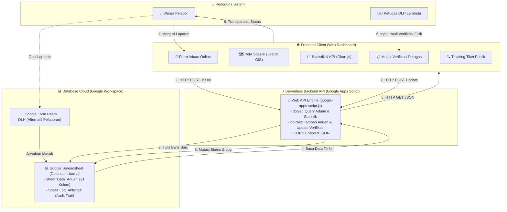

# 📋 Rencana Pengembangan Aplikasi

## OPTIMALISASI PENANGANAN DAN VERIFIKASI ADUAN MASYARAKAT TERKAIT DUGAAN PENCEMARAN LINGKUNGAN
**Sistem Pendataan Digital Berbasis Google Form, Google Spreadsheet, dan Google Maps**  
**Dinas Lingkungan Hidup Kabupaten Lembata**

---

## 1. 🎯 Latar Belakang & Tujuan

### Permasalahan
- Penanganan aduan masyarakat terkait dugaan pencemaran lingkungan masih manual/konvensional (surat fisik atau pesan lisan).
- Proses verifikasi aduan lambat, sulit terdokumentasi, dan tidak terstruktur.
- Belum ada sistem pelacakan (*tracking*) status tindak lanjut aduan secara transparan bagi masyarakat.
- Data aduan tersebar dan belum terarsip secara terpusat untuk keperluan analisis kebijakan lingkungan.
- Belum ada pemetaan visual titik lokasi pencemaran di wilayah Kabupaten Lembata.

### Tujuan Aktualisasi
1. **Digitalisasi** alur penerimaan aduan masyarakat secara mudah dan cepat.
2. **Mempercepat** proses verifikasi lapangan dan respon tindak lanjut petugas DLH.
3. **Memvisualisasikan** lokasi titik dugaan pencemaran secara geografis (Peta Spasial).
4. **Menyediakan Dashboard Monitoring Real-time** untuk pimpinan dan petugas DLH Kabupaten Lembata.
5. **Meningkatkan Akuntabilitas & Transparansi** pelayanan publik di bidang pengelolaan lingkungan hidup.

---

## 2. 🏗️ Arsitektur Sistem (Google Spreadsheet + Google Apps Script Web API)

### Komponen Utama

| No | Komponen | Platform / Teknologi | Peran & Fungsi Teknis |
|---|---|---|---|
| 1 | **Formulir Pengaduan** | Web Form & Google Form | Antarmuka pengisian laporan bagi warga (bisa via web langsung atau QR Code Google Form). |
| 2 | **Database Cloud** | Google Spreadsheet | Database utama, penyimpanan 21 kolom atribut data aduan, dan pencatatan audit log verifikasi. |
| 3 | **Web API Backend** | Google Apps Script (`google-apps-script.js`) | API Serverless perantara (REST-like): Menangani endpoint `GET` (ambil data/rekap) dan `POST` (tambah aduan/update status verifikasi) berformat JSON. |
| 4 | **Web Portal & Dashboard** | HTML5, CSS Modern, Vanilla JS | Antarmuka interaktif responsif untuk publik dan petugas DLH tanpa beban server luar (*serverless client*). |
| 5 | **Sistem Pemetaan Spasial** | Leaflet.js / OpenStreetMap | Pemetaan visual titik koordinat pencemaran 9 kecamatan dengan penanda warna status. |
| 6 | **Analisis Statistik** | Chart.js | Visualisasi KPI (rasio status, sebaran wilayah, dan jenis pencemaran). |

---

## 3. 📝 Format Google Form (Formulir Aduan Warga)

### Daftar Pertanyaan & Validasi

| No | Field / Pertanyaan | Tipe Input | Status | Penjelasan / Pilihan |
|---|---|---|---|---|
| 1 | Nama Lengkap Pelapor | Teks Singkat | Wajib | Identitas pelapor (dijamin kerahasiaannya) |
| 2 | Nomor HP / WhatsApp | Teks Singkat (Nomor) | Wajib | Untuk konfirmasi petugas & update status |
| 3 | Alamat Domisili Pelapor | Teks Paragraf | Wajib | Alamat tempat tinggal pelapor |
| 4 | Kecamatan Lokasi Kejadian | Dropdown | Wajib | 9 Kecamatan di Kab. Lembata |
| 5 | Desa / Kelurahan | Teks Singkat | Wajib | Nama desa/kelurahan titik lokasi |
| 6 | Alamat Detail / Patokan Lokasi | Teks Paragraf | Wajib | Keterangan patokan (dekat pasar, pantai, dll) |
| 7 | Koordinat GPS (Opsional) | Teks Singkat | Opsional | Format Latitude, Longitude dari Google Maps |
| 8 | Jenis Dugaan Pencemaran | Pilihan Ganda / Checkbox | Wajib | Pencemaran Air, Udara, Tanah, Laut / Pesisir, Sampah Ilegal, B3 |
| 9 | Tanggal & Waktu Kejadian | Tanggal & Waktu | Wajib | Waktu pertama kali diketahui |
| 10 | Uraian / Kronologi Aduan | Teks Paragraf | Wajib | Penjelasan detail dampak dan kondisi lingkungan |
| 11 | Dugaan Pihak Sumber Pencemar | Teks Singkat | Opsional | Usaha/perusahaan/oknum yang diduga |
| 12 | Upload Bukti Foto / Video | Upload File Drive | Opsional | Dokumentasi visual kondisi pencemaran |

### Daftar 9 Kecamatan di Kabupaten Lembata
1. **Nubatukan** (Kota Lewoleba)
2. **Ile Ape**
3. **Ile Ape Timur**
4. **Lebatukan**
5. **Nagawutung**
6. **Wulandoni**
7. **Atadei**
8. **Omesuri**
9. **Buyasuri**

---

## 4. 📊 Struktur Google Spreadsheet & Spesifikasi Google Apps Script API

### 4.1 Struktur Database Google Spreadsheet

Sistem menggunakan skema database terintegrasi yang dikelola via Google Apps Script:

#### Sheet 1: `Data_Aduan` (21 Kolom Standar DLH)
1. **`ID_Aduan`**: Nomor register unik (format: `ADU-LMB-YYYY-XXX`).
2. **`Timestamp`**: Waktu pencatatan sistem (YYYY-MM-DD HH:mm:ss).
3. **`Nama_Pelapor`**: Identitas warga pelapor.
4. **`No_HP`**: Nomor kontak / WhatsApp aktif pelapor.
5. **`Alamat_Pelapor`**: Alamat domisili pelapor di Lembata.
6. **`Kecamatan`**: Salah satu dari 9 kecamatan di Kab. Lembata.
7. **`Desa_Kelurahan`**: Desa / kelurahan titik lokasi aduan.
8. **`Lokasi_Detail`**: Patokan atau keterangan lokasi spesifik.
9. **`Latitude`**: Koordinat Lintang geografis (contoh: `-8.3615`).
10. **`Longitude`**: Koordinat Bujur geografis (contoh: `123.5512`).
11. **`Jenis_Pencemaran`**: Kategori dugaan pencemaran lingkungan.
12. **`Uraian_Aduan`**: Kronologi dan dampak pencemaran.
13. **`Sumber_Dugaan`**: Pihak/usaha yang diduga sebagai penyebab.
14. **`Tanggal_Kejadian`**: Tanggal pertama kali diketahui.
15. **`Link_Foto_Bukti`**: Tautan dokumentasi foto/video (Google Drive).
16. **`Status`**: `Baru` | `Diverifikasi` | `Ditindaklanjuti` | `Selesai` | `Ditolak`.
17. **`Petugas_Verifikasi`**: Nama/jabatan verifikator DLH yang turun ke lapangan.
18. **`Tanggal_Verifikasi`**: Waktu pemeriksaan lapangan.
19. **`Hasil_Verifikasi`**: Kesimpulan temuan fisik faktual di lapangan.
20. **`Tindakan_DLH`**: Rekomendasi/tindakan nyata penanganan DLH.
21. **`Tanggal_Selesai`**: Tanggal perkara dinyatakan tuntas.

#### Sheet 2: `Log_Aktivitas` (Audit Trail)
- **`Timestamp`**: Waktu perubahan data.
- **`ID_Aduan`**: ID laporan terkait.
- **`Aktivitas`**: `INSERT_ADUAN` atau `UPDATE_VERIFIKASI`.
- **`Keterangan`**: Detail status lama dan status baru beserta aktor verifikator.

---

### 4.2 Spesifikasi Google Apps Script (Web API)
Skrip backend tersimpan di root folder: [`google-apps-script.js`](file:///d:/app/google-apps-script.js).  
Panduan instalasi dan pengujian lengkap tersedia di: [`DOKUMENTASI-GOOGLE-APPS-SCRIPT.md`](file:///d:/app/DOKUMENTASI-GOOGLE-APPS-SCRIPT.md).

#### Endpoint API:
- **`GET ?action=getAll`**: Mengambil seluruh daftar aduan dalam format JSON untuk dirender ke peta dan tabel dashboard.
- **`GET ?action=getById&id={ID}`**: Mengambil data detail 1 aduan untuk pelacakan tiket publik / modal verifikasi.
- **`GET ?action=getStats`**: Mengambil ringkasan metrik analitik (total aduan, rasio status, sebaran kecamatan) untuk grafik Chart.js.
- **`POST body: { action: "addAduan", data: {...} }`**: Menerima input formulir dari web, menerbitkan ID otomatis, dan menyimpannya ke baris baru Google Spreadsheet.
- **`POST body: { action: "updateVerifikasi", data: {...} }`**: Menerima pembaruan verifikasi dari petugas DLH, memperbarui status, dan mencatat riwayat ke log aktivitas.

---

## 5. 🌐 Rancangan Antarmuka Web Dashboard

Aplikasi web portal memiliki 5 modul utama yang dirancang elegan, modern, dan responsif:

1. **Beranda (Portal Utama):** Ringkasan capaian, alur pengaduan, pengumuman, dan tautan cepat ke formulir aduan.
2. **Peta Sebaran Spasial (GIS Mini):** Peta interaktif wilayah Kabupaten Lembata dengan penanda titik lokasi dugaan pencemaran berdasar warna status:
   - 🔴 **Merah:** Masuk / Menunggu Verifikasi
   - 🟡 **Kuning:** Diverifikasi / Dalam Penanganan
   - 🟢 **Hijau:** Selesai Ditangani
   - ⚪ **Abu-abu:** Ditolak / Tidak Terbukti
3. **Data & Verifikasi Aduan:** Tabel interaktif pencarian (search), filter kecamatan/jenis/status, paginasi, rincian modal aduan, serta form simulasi verifikasi petugas.
4. **Statistik & KPI Dashboard:** Visualisasi grafik Chart.js untuk rekapitulasi bulanan, proporsi jenis pencemaran, persentase efektivitas penanganan.
5. **Profil DLH & SOP:** Profil instansi DLH Lembata, dasar hukum lingkungan (UU 32/2009), alur penanganan aduan (SOP), dan kontak pengaduan.

---

## 6. ⏱️ Rencana Aksi Aktualisasi (Jadwal 14 Hari)

| Fase | Kegiatan | Target Output |
|---|---|---|
| **Fase 1** (Hari 1-2) | Penyusunan form instrumen & integrasi spreadsheet | Link Google Form & Struktur Sheet terstandar |
| **Fase 2** (Hari 3-5) | Pembangunan arsitektur web & desain sistem (CSS/HTML) | Kerangka antarmuka & desain responsif |
| **Fase 3** (Hari 6-8) | Pembuatan peta interaktif spasial & sistem koordinat | Peta sebaran titik aduan dengan filter aktif |
| **Fase 4** (Hari 9-10) | Pembuatan tabel data aduan & modul pelacakan status | Fitur filter, pencarian, dan modal rincian |
| **Fase 5** (Hari 11-12) | Pembuatan grafik dashboard statistik & integrasi live | Grafik visualisasi analitik DLH |
| **Fase 6** (Hari 13-14) | Uji coba sistem, simulasi verifikasi lapangan, & dokumentasi | Sistem siap digunakan & dipresentasikan |
